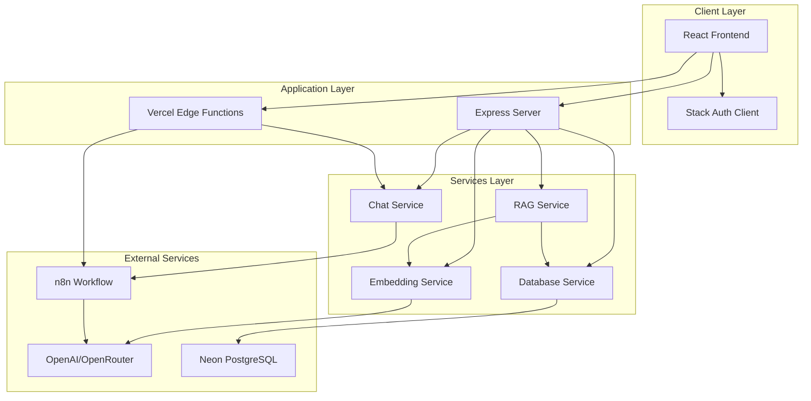
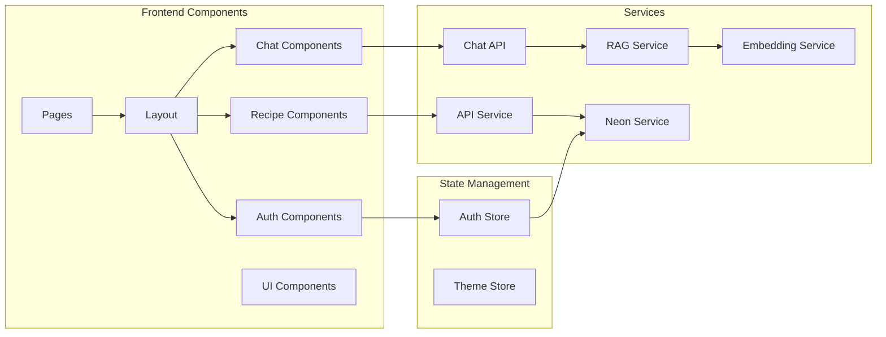
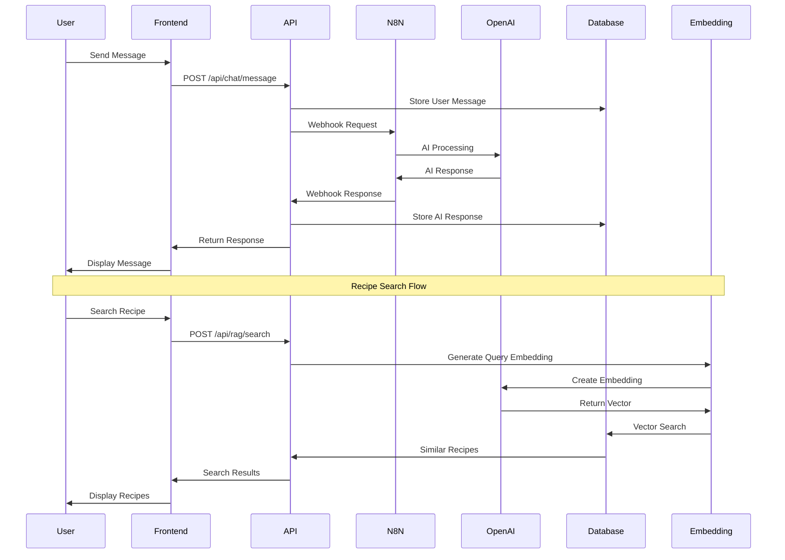
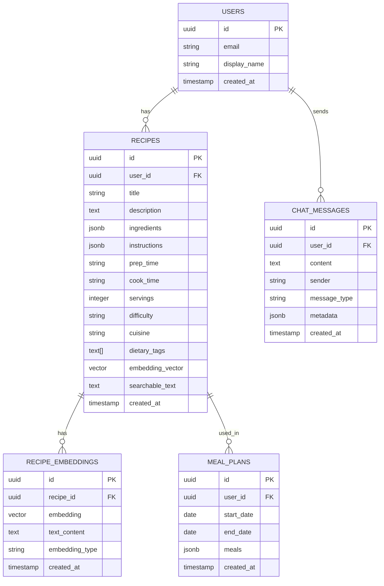
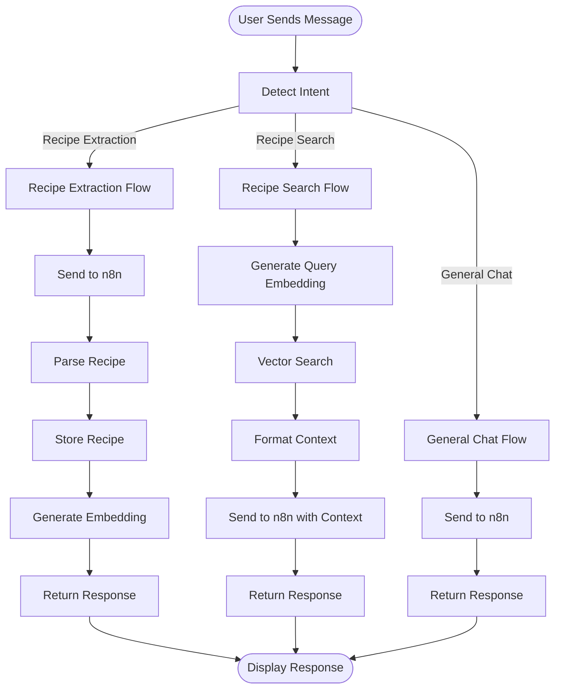
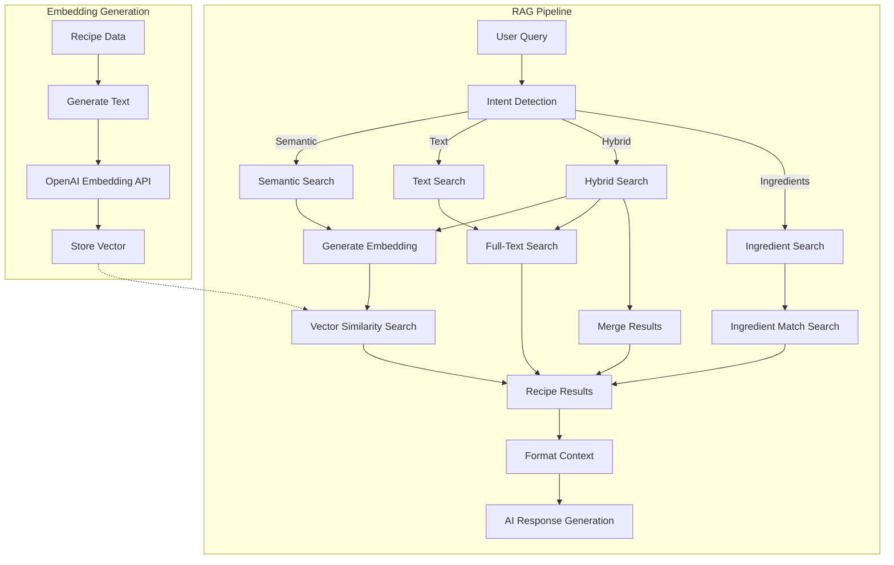
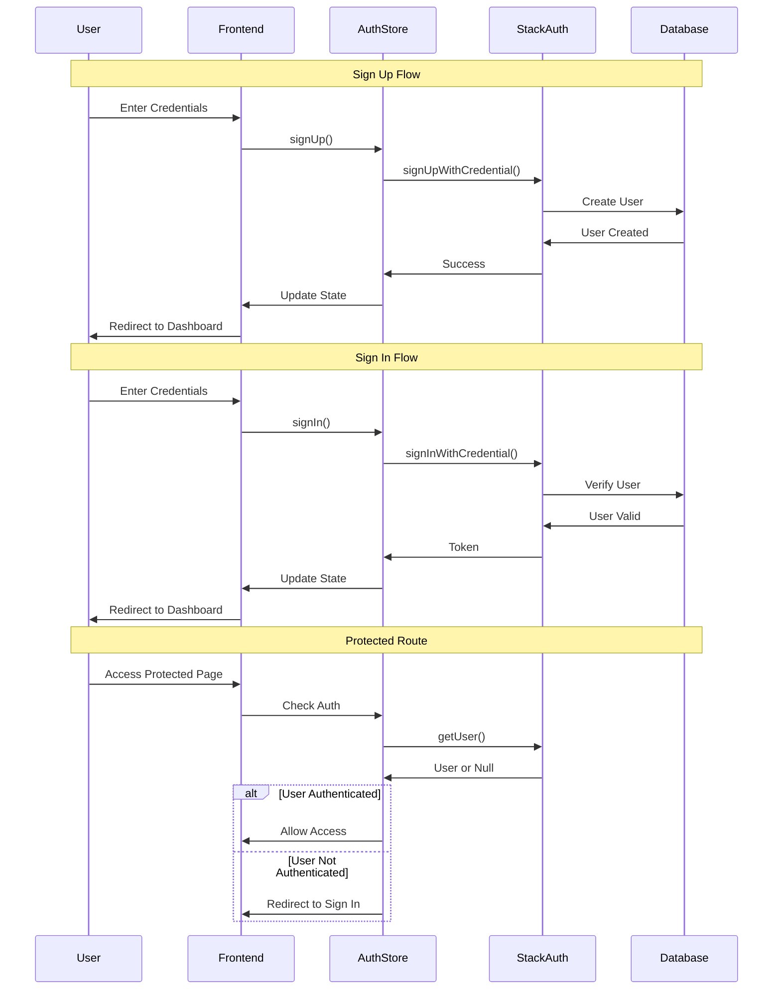
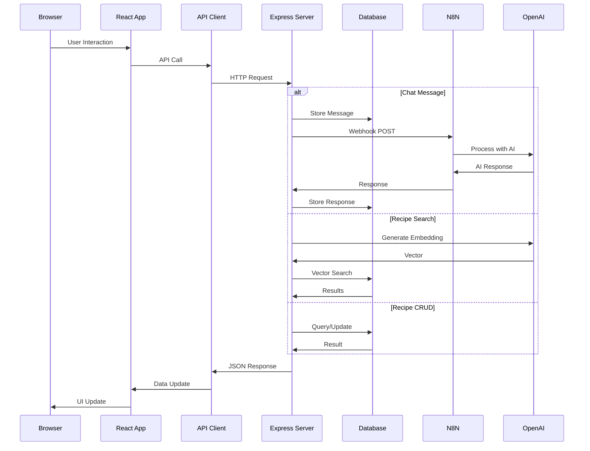
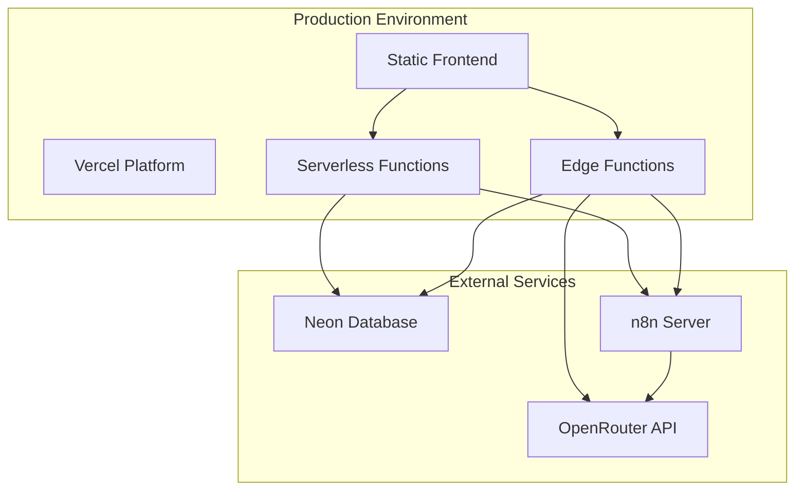

# MealPrep Agent - Comprehensive Architecture Analysis

## Executive Summary

MealPrep Agent is an AI-powered meal planning and recipe management system designed for families. The platform combines conversational AI, automated grocery planning, and personalized recipe recommendations using a modern full-stack architecture with RAG (Retrieval-Augmented Generation) capabilities.

## Core Architecture Overview

### Technology Stack

**Frontend:**
- Framework: React 18 with TypeScript
- Build Tool: Vite 4
- State Management: Zustand
- Data Fetching: React Query (TanStack Query)
- Routing: React Router v6
- Styling: Tailwind CSS with dark mode support
- UI Components: Radix UI + custom components
- Forms: React Hook Form
- Icons: Lucide React

**Backend:**
- Runtime: Node.js with Express.js
- Database: PostgreSQL (Neon) with pgvector extension
- Authentication: StackFrame (Stack Auth)
- AI Integration: n8n webhooks for workflow orchestration
- Embeddings: OpenAI (via OpenRouter) - text-embedding-ada-002
- Deployment: Vercel (Edge Functions + Serverless)

**Infrastructure:**
- Database: Neon PostgreSQL with vector search capabilities
- Vector Storage: pgvector extension for semantic search
- Workflow Automation: n8n for AI agent orchestration
- Edge Computing: Vercel Edge Functions

## System Architecture Diagram

## Component Architecture

## Data Flow Architecture

## Database Schema Architecture

## Chat Flow Architecture

## RAG System Architecture

## Authentication Flow

## Request-Response Flow

## Deployment Architecture

## Key Design Patterns

### 1. Service Layer Pattern
- **Location**: `src/services/`
- **Purpose**: Abstracts API calls and business logic
- **Services**: `api.ts`, `chatApi.ts`, `ragService.ts`, `embeddingService.ts`, `database.ts`

### 2. Repository Pattern
- **Location**: `src/services/database.ts`
- **Purpose**: Encapsulates database operations
- **Methods**: CRUD operations for recipes, embeddings, and chat messages

### 3. State Management Pattern
- **Location**: `src/stores/`
- **Purpose**: Centralized state management with Zustand
- **Stores**: `authStore.ts`, `themeStore.ts`

### 4. Component Composition Pattern
- **Location**: `src/components/`
- **Purpose**: Reusable, composable UI components
- **Structure**: Pages → Layout → Feature Components → UI Components

### 5. RAG Pattern
- **Location**: `src/services/ragService.ts`, `server.js`
- **Purpose**: Retrieval-Augmented Generation for context-aware responses
- **Flow**: Query → Embedding → Vector Search → Context Injection → AI Response

## Data Flow Patterns

### Chat Message Flow
1. User sends message via `ChatInterface`
2. Intent detection via `detectIntent()` in `ragService.ts`
3. Route to appropriate handler:
   - Recipe extraction → n8n webhook
   - Recipe search → RAG search + n8n
   - General chat → n8n webhook
4. Response stored in conversation state
5. UI updates with new message

### Recipe Storage Flow
1. Recipe data received from n8n or user input
2. Stored in PostgreSQL via `database.ts`
3. Text content generated for embedding
4. Embedding generated via OpenAI API
5. Vector stored in `recipe_embeddings` table
6. Recipe searchable via semantic search

### RAG Search Flow
1. User query received
2. Query embedding generated
3. Vector similarity search in database
4. Top-K recipes retrieved
5. Context formatted for AI
6. Context injected into n8n workflow
7. AI generates response with recipe context

## API Endpoints

### Chat Endpoints
- `POST /api/chat/message` - Send chat message
- `GET /api/chat/history` - Get chat history
- `DELETE /api/chat/history` - Clear chat history

### Recipe Endpoints
- `GET /api/recipes` - Get all recipes
- `GET /api/recipes/:id` - Get single recipe
- `POST /api/recipes` - Create recipe
- `PUT /api/recipes/:id` - Update recipe
- `DELETE /api/recipes/:id` - Delete recipe

### RAG Endpoints
- `POST /api/rag/search` - Semantic search
- `POST /api/rag/ingredients` - Ingredient-based search
- `GET /api/rag/similar/:recipeId` - Find similar recipes
- `POST /api/rag/recommendations` - Get recommendations
- `POST /api/rag/embedding` - Generate embedding

### Health Endpoints
- `GET /api/health` - Health check
- `GET /api/test-webhook` - Test n8n webhook

## Security Architecture

### Authentication
- **Provider**: StackFrame (Stack Auth)
- **Method**: Credential-based (email/password)
- **Storage**: Cookie-based token storage
- **Protection**: Protected routes via `ProtectedRoute` component

### Authorization
- **Database**: Row-Level Security (RLS) enabled
- **User Isolation**: All queries filtered by `user_id`
- **API**: User context extracted from auth token

### Data Protection
- **HTTPS**: All communications encrypted
- **Environment Variables**: Sensitive data in `.env`
- **CORS**: Configured for specific origins

## Performance Optimizations

### Frontend
- **Code Splitting**: Lazy loading of routes
- **React Query**: Caching and automatic refetching
- **Memoization**: React.memo for expensive components
- **Virtual Scrolling**: For large lists (future)

### Backend
- **Connection Pooling**: PostgreSQL connection pool
- **Vector Indexing**: IVFFlat indexes for fast vector search
- **Edge Functions**: Low-latency edge computing
- **Caching**: React Query cache on frontend

### Database
- **Indexes**: Strategic indexes on frequently queried columns
- **Vector Indexes**: IVFFlat indexes for embedding vectors
- **Full-Text Search**: PostgreSQL full-text search indexes
- **Query Optimization**: Efficient SQL queries with proper joins

## Scalability Considerations

### Horizontal Scaling
- **Stateless API**: Serverless functions can scale independently
- **Database**: Neon PostgreSQL supports horizontal scaling
- **Edge Functions**: Automatically scales with traffic

### Vertical Scaling
- **Database**: Can upgrade Neon instance for more resources
- **Vector Search**: Optimized with proper indexes
- **Caching**: React Query reduces database load

### Future Enhancements
- **CDN**: For static assets
- **Redis**: For session and cache management
- **Message Queue**: For async processing
- **Load Balancing**: For n8n instances

## Error Handling

### Frontend
- **React Query**: Automatic error handling and retries
- **Error Boundaries**: Catch component errors
- **Toast Notifications**: User-friendly error messages
- **Fallback UI**: Graceful degradation

### Backend
- **Try-Catch**: Comprehensive error handling
- **HTTP Status Codes**: Proper status code usage
- **Error Logging**: Console logging for debugging
- **Graceful Degradation**: Fallback responses when services unavailable

## Monitoring & Logging

### Current Implementation
- **Console Logging**: Detailed logs for debugging
- **Error Tracking**: Error messages logged to console
- **Health Checks**: `/api/health` endpoint

### Future Enhancements
- **Application Monitoring**: Sentry or similar
- **Performance Monitoring**: Vercel Analytics
- **Database Monitoring**: Neon dashboard
- **Log Aggregation**: Centralized logging system

## Development Workflow

### Local Development
1. Frontend: `npm run dev` (Vite dev server)
2. Backend: `npm run server` (Express server)
3. Database: Neon cloud database
4. n8n: External n8n server

### Build Process
1. TypeScript compilation
2. Vite build
3. Static asset optimization
4. Deployment to Vercel

### Testing Strategy
- **Unit Tests**: Component and service tests (future)
- **Integration Tests**: API endpoint tests (future)
- **E2E Tests**: User flow tests (future)

## Conclusion

The MealPrep Agent architecture is designed for:
- **Scalability**: Serverless and edge computing
- **Performance**: Vector search and caching
- **Maintainability**: Clear separation of concerns
- **Extensibility**: Modular service architecture
- **User Experience**: Fast, responsive interface

The system leverages modern technologies and best practices to provide a robust, scalable platform for AI-powered meal planning and recipe management.

