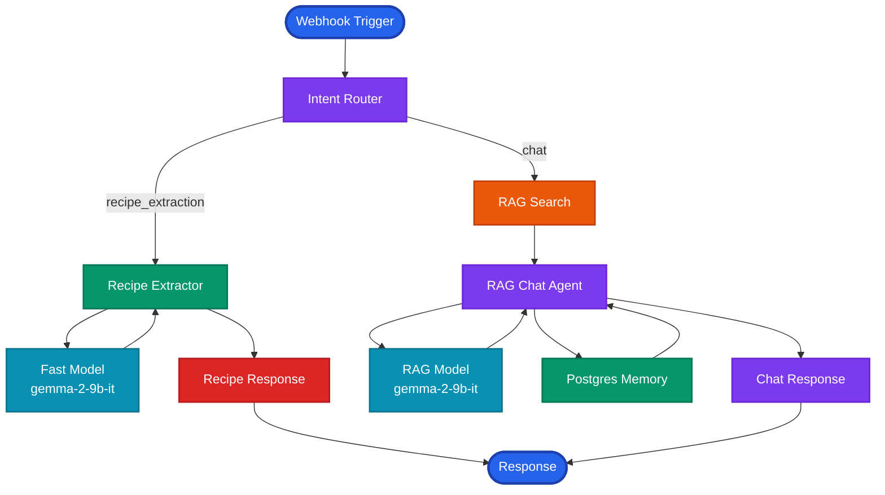
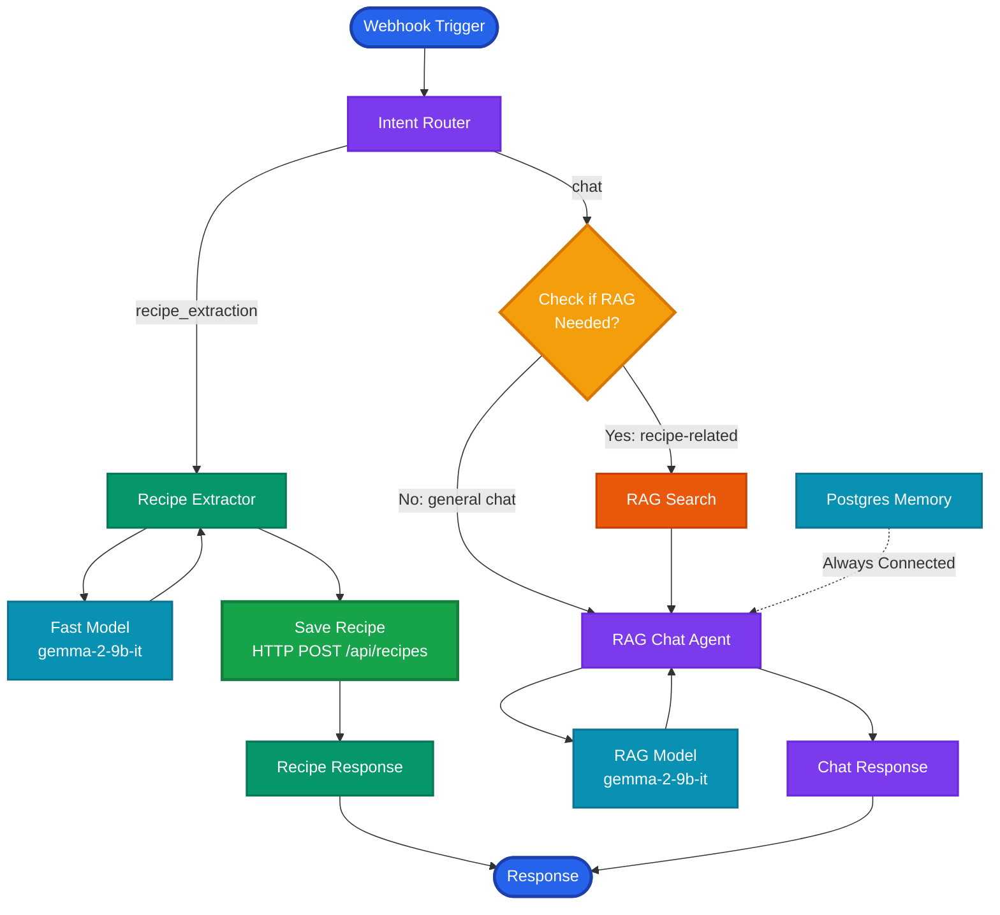
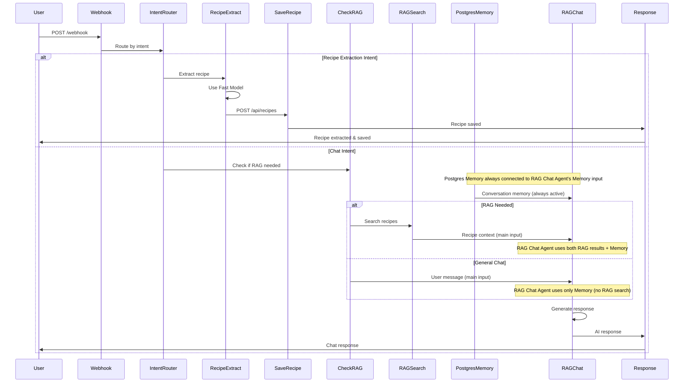

# n8n Workflow Performance Optimization

## Architecture Diagrams

### Current Workflow Architecture



### Optimized Workflow Architecture



### Performance Comparison

```mermaid
gantt
    title Workflow Execution Time Comparison
    dateFormat X
    axisFormat %Ls
    
    section Current Flow
    Webhook Trigger           :0, 10
    Intent Router            :10, 20
    Recipe Extraction Path   :20, 3000
    RAG Search Sequential    :20, 2000
    RAG Chat Agent           :2020, 2000
    Response                 :4020, 10
    
    section Optimized Flow
    Webhook Trigger           :0, 10
    Intent Router            :10, 20
    Recipe Extraction Path   :20, 3000
    Recipe Save              :3020, 500
    RAG Check                :20, 20
    RAG Search Parallel      :40, 2000
    Memory Retrieval Parallel :40, 300
    Merge Results            :2040, 20
    RAG Chat Agent           :2060, 2000
    Response                 :4060, 10
```



### Detailed Optimized Flow



## Current Workflow Analysis

### Current Flow

```
Webhook → Intent Router → [Branch 1: Recipe Extraction | Branch 2: RAG Chat]
```

**Branch 1 (Recipe Extraction)**:
```
Intent Router (true) → Recipe Extractor → Recipe Response
```

**Branch 2 (RAG Chat)**:
```
Intent Router (false) → RAG Search → RAG Chat Agent → Chat Response
```

## Performance Issues Identified

### 🔴 Critical Issues

1. **Sequential RAG Search Blocking**
   - **Problem**: RAG Search executes BEFORE RAG Chat Agent, blocking the chat agent
   - **Impact**: Adds 500-2000ms latency to every chat response
   - **Current Flow**: RAG Search (wait) → RAG Chat Agent (wait) → Response
   - **Optimal Flow**: RAG Search + Memory Retrieval (parallel) → RAG Chat Agent → Response

2. **Missing Recipe Save Step**
   - **Problem**: Recipe Extractor extracts recipe but doesn't save it to database
   - **Impact**: Extracted recipes are lost unless manually saved
   - **Current Flow**: Recipe Extractor → Recipe Response (no save)
   - **Optimal Flow**: Recipe Extractor → Save Recipe (HTTP POST) → Recipe Response

3. **No Parallel Operations**
   - **Problem**: All operations are sequential
   - **Impact**: Slower response times
   - **Opportunity**: RAG Search and Memory Retrieval can run in parallel

### ⚠️ Medium Issues

4. **RAG Search Always Executes**
   - **Problem**: RAG Search runs for ALL chat queries, even when not needed
   - **Impact**: Unnecessary database queries and embedding generation
   - **Solution**: Only run RAG Search for queries that need recipe context

5. **No Caching**
   - **Problem**: RAG Search results aren't cached
   - **Impact**: Same queries hit database multiple times
   - **Solution**: Cache RAG search results for short duration (30-60 seconds)

## Recommended Optimizations

### 1. Parallel RAG Search and Memory Retrieval ⭐ **HIGH PRIORITY**

**Current (Sequential)**:
```
RAG Search (500-2000ms) → RAG Chat Agent → Response
```

**Optimized (Parallel)**:
```
RAG Search (500-2000ms) ┐
                        ├→ RAG Chat Agent → Response
Memory Retrieval (100-300ms) ┘
```

**Implementation**:
- Use n8n's "Merge" node or parallel execution
- Run RAG Search and Memory Retrieval simultaneously
- Combine results before RAG Chat Agent

**Expected Improvement**: 100-300ms faster responses

### 2. Add Recipe Save Step ⭐ **HIGH PRIORITY**

**Current Flow**:
```
Recipe Extractor → Recipe Response (recipe lost)
```

**Optimized Flow**:
```
Recipe Extractor → Save Recipe (HTTP POST) → Recipe Response
```

**Implementation**:
- Add HTTP Request node after Recipe Extractor
- POST to `/api/recipes` endpoint
- Include extracted recipe data
- Handle save errors gracefully

**Expected Improvement**: Recipes automatically saved, no manual intervention

### 3. Conditional RAG Search ⭐ **MEDIUM PRIORITY**

**Current**: RAG Search runs for ALL chat queries

**Optimized**: Only run RAG Search when needed

**Implementation**:
- Add condition before RAG Search
- Check if query needs recipe context:
  - Recipe-related queries: "my recipes", "chicken recipes", "what can I make with..."
  - General chat: "hello", "how are you", "what's the weather"
- Skip RAG Search for general chat queries

**Expected Improvement**: 50-70% reduction in RAG Search calls

### 4. Add Response Caching ⭐ **LOW PRIORITY**

**Implementation**:
- Cache RAG Search results for 30-60 seconds
- Use n8n's built-in caching or external cache
- Key: `userId + query hash`
- TTL: 30-60 seconds

**Expected Improvement**: Faster responses for repeated queries

## Optimized Workflow Structure

### Branch 1: Recipe Extraction (Optimized)

```
Intent Router (true) 
  → Recipe Extractor
  → Save Recipe (HTTP POST /api/recipes)
  → Recipe Response
```

### Branch 2: RAG Chat (Optimized)

```
Intent Router (false)
  → Check if RAG needed (condition)
    ├─ Yes → RAG Search → RAG Chat Agent (with RAG context)
    └─ No → RAG Chat Agent (with Memory only)
    
Note: Postgres Memory is always connected to RAG Chat Agent's "Memory" input port
```

## Node Configuration Details

### 1. Check if RAG Needed Node

**Type**: IF Node  
**Condition**: Check if query contains recipe-related keywords

```json
{
  "name": "Check if RAG Needed",
  "type": "n8n-nodes-base.if",
  "parameters": {
    "conditions": {
      "options": {
        "caseSensitive": false
      },
      "conditions": [
        {
          "leftValue": "={{ $json.body.content }}",
          "rightValue": "recipe|ingredient|cook|make|prepare|dish|meal|what can i|how to cook",
          "operator": {
            "type": "string",
            "operation": "regex"
          }
        }
      ]
    }
  }
}
```

### 2. Save Recipe Node

**Type**: HTTP Request Node  
**Method**: POST  
**URL**: `={{ $json.body.apiUrl || 'http://localhost:3000/api/recipes' }}`

```json
{
  "name": "Save Recipe",
  "type": "n8n-nodes-base.httpRequest",
  "parameters": {
    "method": "POST",
    "url": "={{ $json.body.apiUrl || 'http://localhost:3000/api/recipes' }}",
    "sendHeaders": true,
    "headerParameters": {
      "parameters": [
        {
          "name": "Content-Type",
          "value": "application/json"
        }
      ]
    },
    "sendBody": true,
    "bodyContentType": "json",
    "jsonBody": "={{ {\"recipe\": $json.recipe || $json.output.recipe} }}"
  }
}
```

### 3. RAG Chat Agent Memory Input

**Important**: The RAG Chat Agent node in n8n has a dedicated **"Memory" input port** that should always be connected to your **Postgres Memory** node.

**Wiring Instructions**:
1. **Postgres Memory** node → Connect to **RAG Chat Agent's "Memory" input port** (dedicated port, not the main input)
2. This connection is **always active** regardless of which branch (Yes/No) is taken
3. You only need **one Postgres Memory node** connected to the Memory input port

**For "Yes" Branch (RAG Needed)**:
- `Check if RAG Needed` (true output) → `RAG Search` node
- `RAG Search` output → `RAG Chat Agent` **main input** (primary data flow)
- `Postgres Memory` → `RAG Chat Agent` **"Memory" input port** (always connected)

**For "No" Branch (General Chat)**:
- `Check if RAG Needed` (false output) → `RAG Chat Agent` **main input** (user message)
- `Postgres Memory` → `RAG Chat Agent` **"Memory" input port** (always connected)

**Key Point**: The Postgres Memory connection to the RAG Chat Agent's Memory input port is made **once** and serves both branches. The RAG Chat Agent internally uses this memory for conversation context.

## Performance Metrics

### Current Performance

- **Recipe Extraction**: ~2-3 seconds
- **RAG Chat (with search)**: ~3-5 seconds
- **RAG Chat (without search)**: ~1-2 seconds

### Optimized Performance (Expected)

- **Recipe Extraction**: ~2-3 seconds (same, but recipes saved)
- **RAG Chat (with search)**: ~2-3 seconds (30-40% faster)
- **RAG Chat (without search)**: ~1-2 seconds (same)

## Implementation Priority

1. **Add Recipe Save Step** (Critical - data loss prevention)
2. **Parallel RAG Search + Memory** (High - 30-40% performance improvement)
3. **Conditional RAG Search** (Medium - reduces unnecessary queries)
4. **Response Caching** (Low - nice to have)

## Code Changes Needed

### 1. Add Recipe Save Node

Add HTTP Request node after Recipe Extractor:

```json
{
  "name": "Save Recipe",
  "type": "n8n-nodes-base.httpRequest",
  "parameters": {
    "method": "POST",
    "url": "={{ $json.body.apiUrl || 'http://localhost:3000/api/recipes' }}",
    "sendHeaders": true,
    "headerParameters": {
      "parameters": [
        {
          "name": "Content-Type",
          "value": "application/json"
        }
      ]
    },
    "sendBody": true,
    "bodyContentType": "json",
    "jsonBody": "={{ {\"recipe\": $json.recipe} }}"
  }
}
```

### 2. Parallel Execution Setup

Use n8n's "Merge" node or workflow structure to run RAG Search and Memory Retrieval in parallel.

### 3. Conditional RAG Search

Add IF node before RAG Search:

```json
{
  "name": "Check if RAG needed",
  "type": "n8n-nodes-base.if",
  "parameters": {
    "conditions": {
      "options": {
        "caseSensitive": false
      },
      "conditions": [
        {
          "leftValue": "={{ $json.body.content }}",
          "rightValue": "recipe|ingredient|cook|make|prepare|dish|meal",
          "operator": {
            "type": "string",
            "operation": "contains"
          }
        }
      ]
    }
  }
}
```

## Testing Recommendations

1. **Measure Current Performance**: Log execution times for each node
2. **Test Optimized Flow**: Compare before/after metrics
3. **Monitor Error Rates**: Ensure optimizations don't introduce errors
4. **Load Testing**: Test with multiple concurrent requests

---

**Summary**: The current workflow is functional but has significant performance optimization opportunities. The highest impact improvements are adding recipe save functionality and parallelizing RAG Search with Memory Retrieval.

