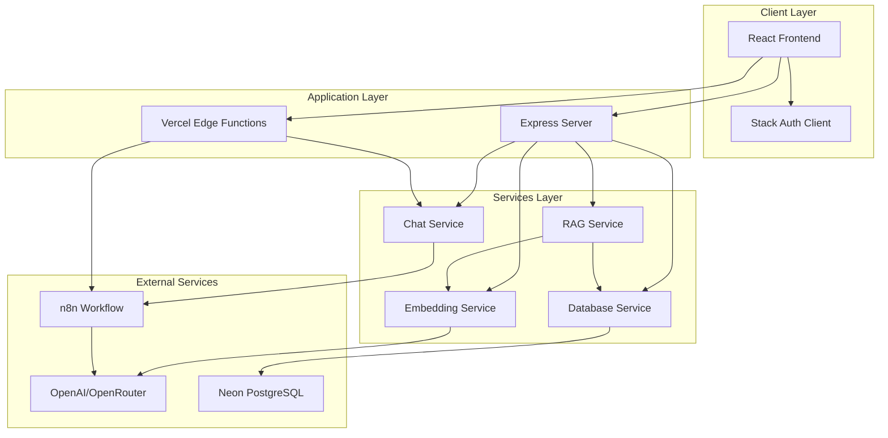
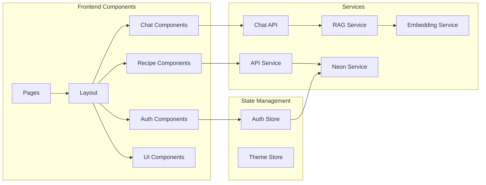
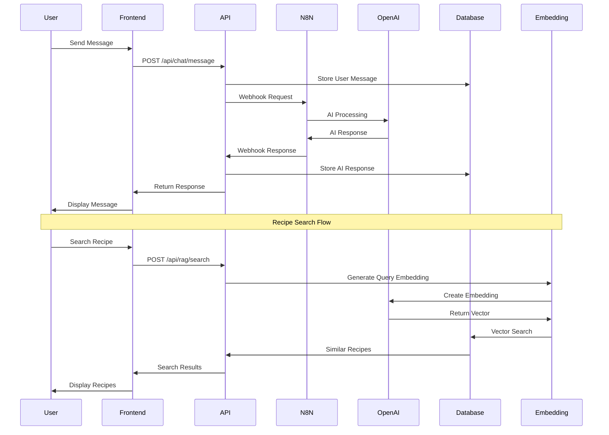
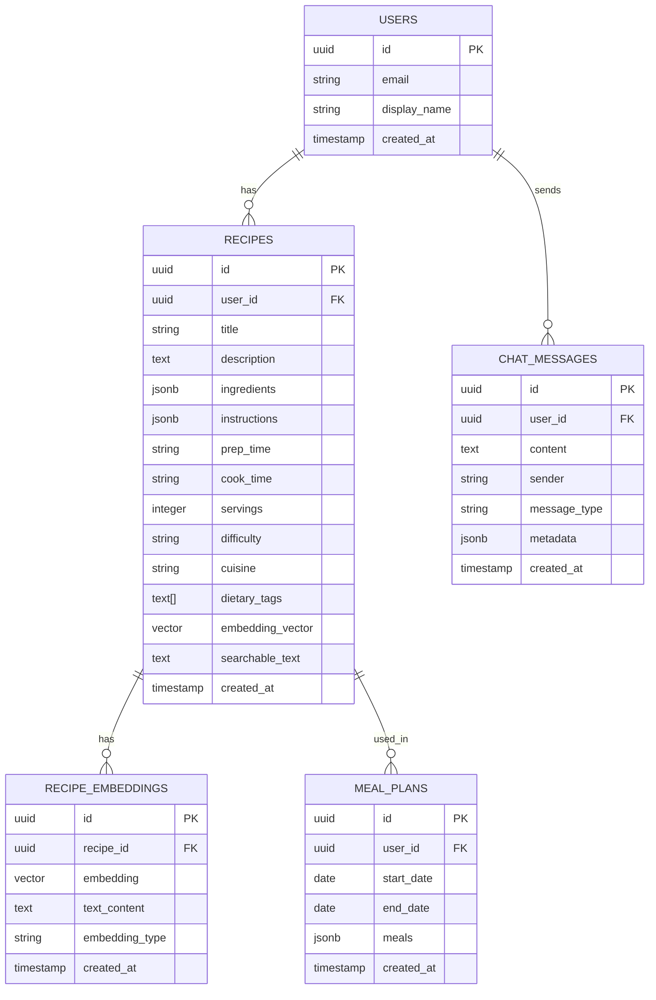
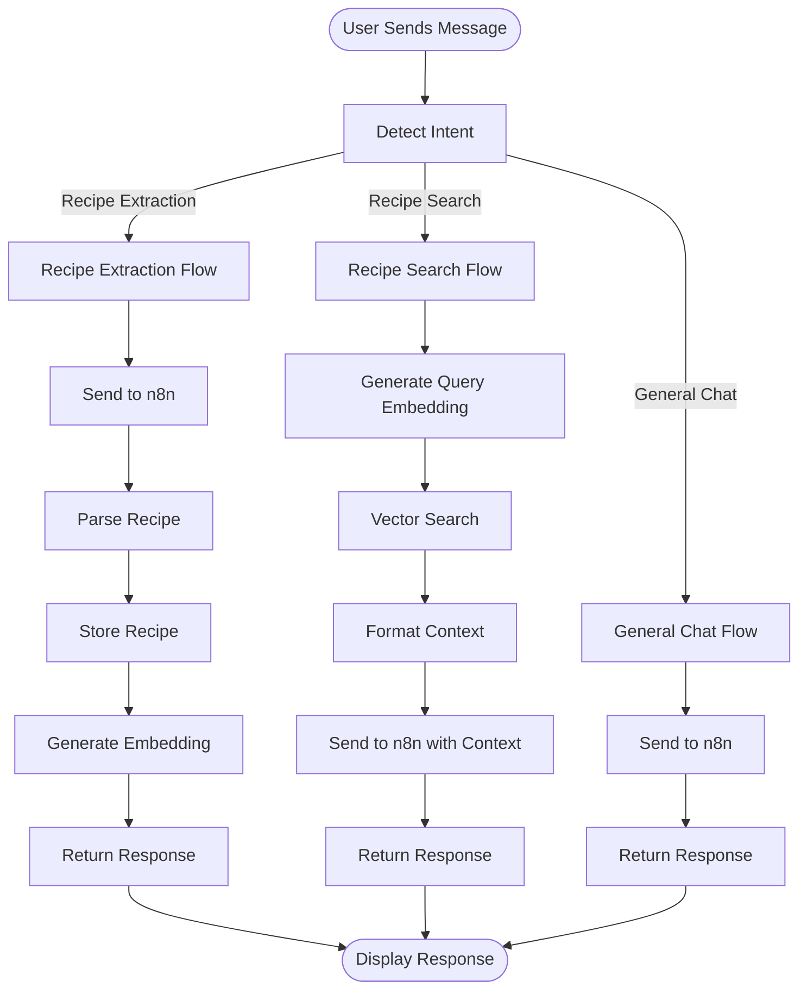
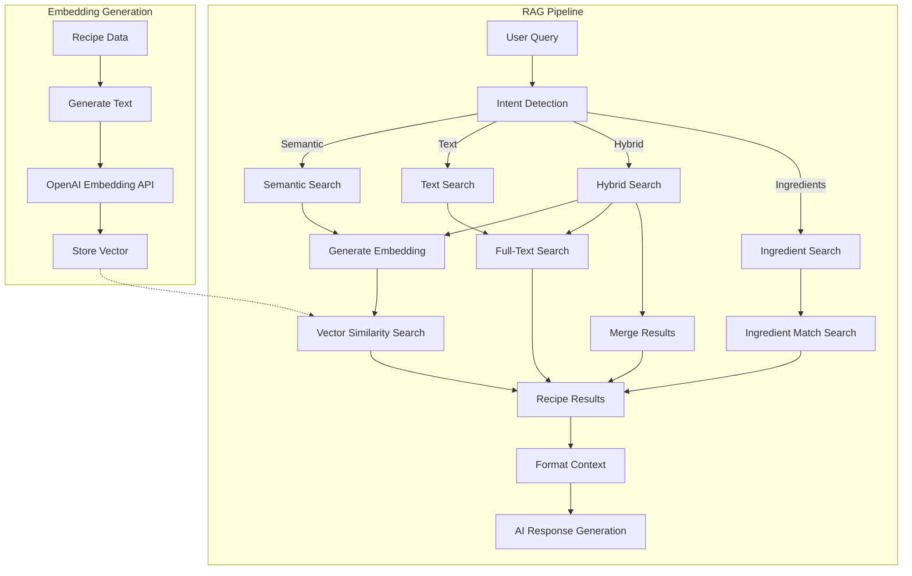
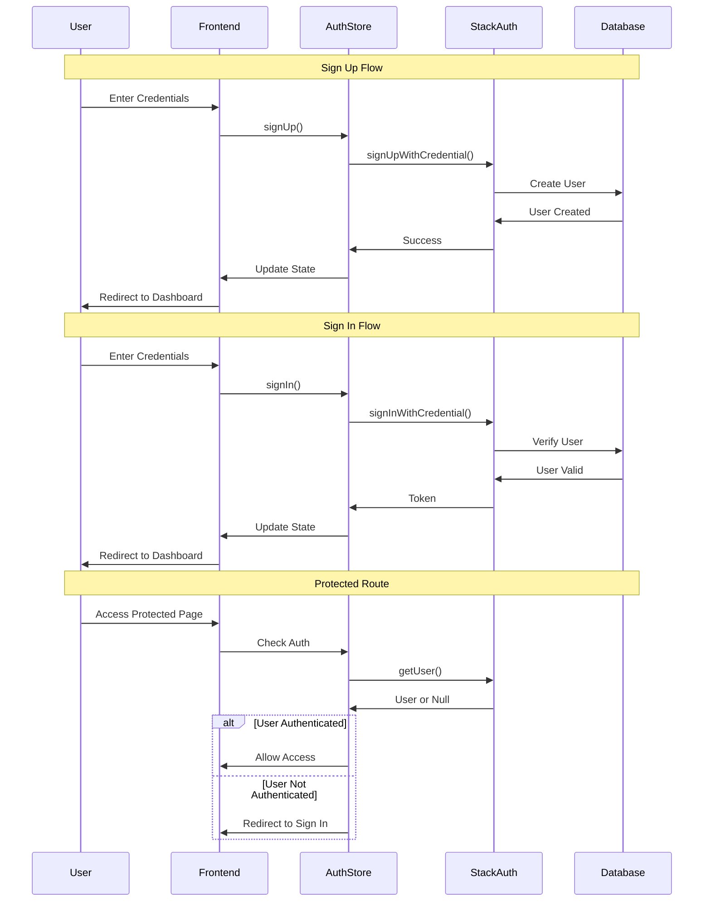
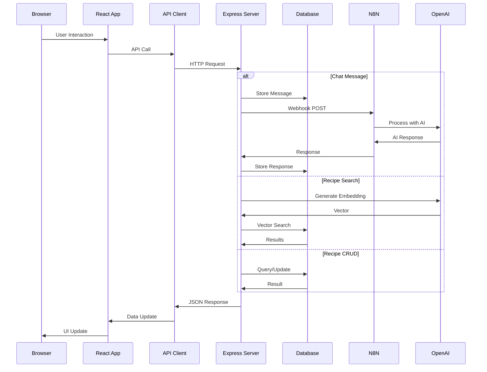
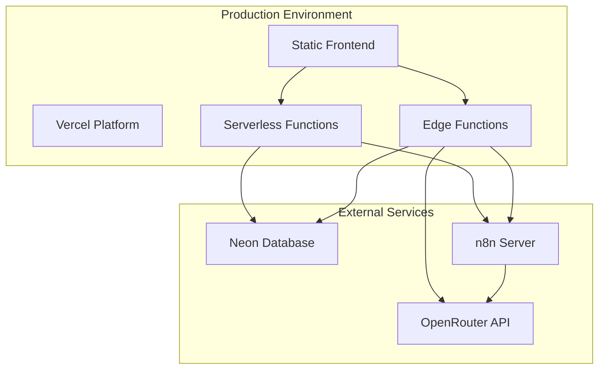

# MealPrep Agent - Architecture Diagrams

This file contains all Mermaid diagrams for the MealPrep Agent architecture. These diagrams can be rendered in any Markdown viewer that supports Mermaid (GitHub, GitLab, VS Code with Mermaid extension, etc.).

## System Architecture

## Component Architecture

## Data Flow Sequence

## Database Schema

## Chat Flow Architecture

## RAG System Architecture

## Authentication Flow

## Request-Response Flow

## Deployment Architecture

---

**Note**: These diagrams can be viewed in:
- GitHub/GitLab (native Mermaid support)
- VS Code (with Mermaid extension)
- Online Mermaid editors (mermaid.live)
- Documentation sites (MkDocs, Docusaurus, etc.)

