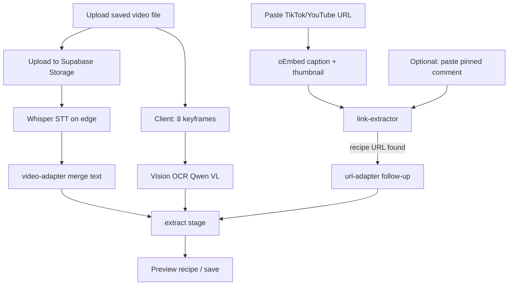

# MOP-0016: Short-Form Video Recipe Intake (ToS-Compliant)

| Field | Value |
|-------|-------|
| **MOP** | MOP-0016 |
| **Title** | Short-Form Video Recipe Intake (ToS-Compliant) |
| **Date Submitted** | 2026-06-15 |
| **Date Updated** | 2026-06-16 (Phase 3b UX + persist/history + image-on-save; `chat-api` deployed; `recipe-pipeline` deploy pending operator smoke) |
| **Date Completed** | — |
| **Submitted By** | Nick Neal |
| **Status** | in_progress |

> **Shipped as of 2026-06-15:**
> - **oEmbed path:** TikTok + YouTube official oEmbed (`platform-oembed.ts`) — caption, author, thumbnail
> - **Link mining:** `link-extractor.ts` — recipe URLs from caption / pasted comment text
> - **URL routing:** TikTok/YouTube/Reels `source_type: url` auto-routes to `video-adapter` (no HTML scrape)
> - **Transcription:** `transcribe-media.ts` — user-uploaded video/audio only (`openai/whisper-large-v3` → Gemini fallback)
> - **Frame OCR:** client `videoFrameExtractor.ts` + server vision OCR on up to 8 frames
> - **Pipeline fields:** `pinned_comment_text`, `supplementary_text`, `media_url`, `media_base64`, `auto_transcribe`
> - **Frontend:** `videoIntake.ts` service, `uploadIntakeMedia`, chat file picker accepts saved video
> - **Chat tool:** `extract_recipe_from_source` supports `source_type: video`
>
> **Shipped as of 2026-06-16 (branch `cursor/mop-0008-golden-routing-video-intake`):**
> - **Keyframe picker:** `src/utils/recipeImagePicker.ts` — best frame for preview + upload on save
> - **oEmbed thumbnail:** `source_metadata.extra.thumbnail_url` from `video-adapter.ts`
> - **Extract routing fix:** `extract.ts` — text path when caption/OCR ≥80 chars (don't force vision on thumbnail-only)
> - **Chat persist:** `POST /chat-api/persist-extraction` + `conversation-context.ts` for follow-ups without save
> - **Source credit + image on save:** `StructuredRecipeDisplay` uploads keyframe/thumbnail; `source_url` / `source_name` on recipe row
> - **Chat UX:** stop generation, draft/queue while loading, history refetch on sidebar click
> - **Draft cache:** `src/stores/draftRecipeStore.ts` (sessionStorage for edits; base64 keyframes memory-only)
> - **Inline preview edit:** ingredients + instructions on chat recipe card; compact ingredient row in `RecipeForm`
>
> **Blocked on operator (Nick):** `recipe-pipeline` deploy + live smoke tests (see §Operator Requirements). `chat-api` deployed 2026-06-16.

---

## Summary

Enable legally compliant recipe extraction from short-form video (TikTok, YouTube, Reels) and user-uploaded saved videos. Uses official oEmbed for captions, user-supplied media for voiceover transcription, client-side frame extraction for on-screen text, and optional user-pasted creator comments. Does **not** scrape TikTok CDN, comments HTML, or Research API.

Depends on existing recipe-pipeline + OpenRouter stack. Complements [MOP-0008](MOP-0008.md) chat agent (`extract_recipe_from_source`).

---

## Scope Map

```
supabase/functions/_shared/platform-oembed.ts
supabase/functions/_shared/link-extractor.ts
supabase/functions/_shared/transcribe-media.ts
supabase/functions/_shared/video-url-utils.ts
supabase/functions/recipe-pipeline/adapters/video-adapter.ts
supabase/functions/recipe-pipeline/pipeline.ts
supabase/functions/_shared/recipe-schema.ts
supabase/functions/chat-api/tools/catalog.ts
supabase/functions/chat-api/tools/handlers.ts
src/utils/videoFrameExtractor.ts
src/utils/recipeImagePicker.ts
src/services/videoIntake.ts
src/services/api.ts
src/stores/draftRecipeStore.ts
src/config/queryCache.ts
src/hooks/useRecipePipeline.ts
src/components/chat/ChatInterface.tsx
src/components/chat/StructuredRecipeDisplay.tsx
supabase/functions/chat-api/conversation-context.ts
supabase/functions/chat-api/index.ts
supabase/functions/recipe-pipeline/stages/extract.ts
```

Domain: `recipe-pipeline` per [DOMAIN_TEST_MATRIX.md](../prompts/DOMAIN_TEST_MATRIX.md).

---

## Architecture



### Model map (OpenRouter)

| Step | Model slug | When |
|------|------------|------|
| Transcription | `openai/whisper-large-v3` | User-uploaded video/audio |
| Transcription fallback | `google/gemini-2.5-flash` | Whisper endpoint unavailable |
| Frame OCR | `qwen/qwen-2.5-vl-7b-instruct` | `frame_urls` or oEmbed thumbnail |
| Recipe JSON extract (with images) | `qwen/qwen-2.5-vl-7b-instruct` → `google/gemini-2.0-flash-001` | Frames present |
| Recipe JSON extract (text-only) | `qwen/qwen-2.5-7b-instruct` | Caption + transcript only |

oEmbed and link HTTP fetches use **no** LLM.

---

## Operator Requirements (Nick — outstanding)

> Complete these before promoting to `verifying`. No TikTok or YouTube developer apps required for v1.

### 1. OpenRouter API keys (required)

| Secret | Required | Purpose |
|--------|----------|---------|
| `OPENROUTER_API_KEY_CHAT` | **Yes** | Chat agent tool loop, conversation titles, substitution tool |
| `OPENROUTER_API_KEY_MEDIA` | **Yes** | Recipe extract, vision/OCR, Whisper, embeddings, pipeline fallbacks |

`OPENROUTER_API_KEY` alone still works as a fallback for **both** (single-key dev setup).

Legacy aliases still read at runtime: `OPENROUTER_API_KEY_TEXT`, `OPENROUTER_API_KEY_VISION`. If you previously used `OPENROUTER_API_KEY_QWEN2.5_*` / `OPENROUTER_API_KEY_QWEN2_5_*` in Supabase secrets, rename them to `OPENROUTER_API_KEY_CHAT` and `OPENROUTER_API_KEY_MEDIA`.

**Set in Supabase:**

```bash
npx supabase secrets set OPENROUTER_API_KEY_CHAT=sk-or-v1-CHAT_KEY
npx supabase secrets set OPENROUTER_API_KEY_MEDIA=sk-or-v1-MEDIA_KEY
```

**Verify:**

```bash
npx supabase secrets list
# Must show OPENROUTER_API_KEY_CHAT and OPENROUTER_API_KEY_MEDIA
```

### 3. OpenRouter model access to confirm

In OpenRouter dashboard, ensure these models are available on your account (most default accounts have them):

- `openai/whisper-large-v3` (audio transcriptions endpoint)
- `qwen/qwen-2.5-vl-7b-instruct`
- `qwen/qwen-2.5-7b-instruct`
- `google/gemini-2.5-flash` (transcription fallback only)
- `google/gemini-2.0-flash-001` (extract fallback only)

### 4. Deploy edge functions

After secrets are set:

```bash
npx supabase functions deploy recipe-pipeline
npx supabase functions deploy chat-api
```

### 5. Smoke tests (after deploy)

| Test | Steps | Expected |
|------|-------|----------|
| TikTok URL only | Chat → paste `https://www.tiktok.com/@…/video/…` → agent calls extract or use `processVideoUrl` | Caption mined; recipe or link-follow preview |
| Saved video | Chat → attach MP4 ≤24MB → send | Transcript + frame OCR; preview card |
| Pinned comment | `extractRecipeOnly('url', { url, pinned_comment_text: '…' })` | Link in comment followed |

### 6. Keys NOT required for v1

| Key / API | Status |
|-----------|--------|
| TikTok Developer / Login Kit | **Not needed** — oEmbed only |
| YouTube Data API v3 | **Not needed** — oEmbed title only; full description is future |
| Instagram Graph API | **Not needed** — Reels URL detected but no metadata fetch yet |
| `WEB_SEARCH_API_KEY` | Unrelated to video intake |
| Frontend `VITE_OPENROUTER_*` | **Forbidden** — server-side only |

---

## Scope of Work

### Phase 1: Backend adapters — **complete**

**Files:** `_shared/platform-oembed.ts`, `link-extractor.ts`, `transcribe-media.ts`, `video-url-utils.ts`, `video-adapter.ts` v1.1

### Phase 2: Pipeline + chat tool — **complete**

**Files:** `recipe-schema.ts`, `pipeline.ts`, `chat-api/tools/catalog.ts`, `handlers.ts`

### Phase 3: Frontend intake service + chat attach — **complete**

**Files:** `videoFrameExtractor.ts`, `videoIntake.ts`, `api.ts` (`uploadIntakeMedia`), `ChatInterface.tsx`, `useRecipePipeline.ts`

### Phase 3b: Preview UX + persistence + caching — **complete (2026-06-16)**

**Files:** `recipeImagePicker.ts`, `StructuredRecipeDisplay.tsx`, `draftRecipeStore.ts`, `queryCache.ts`, `chat-api/persist-extraction`, `conversation-context.ts`, `RecipeForm.tsx` (compact ingredient edit)

### Phase 4: Operator setup + smoke — **in progress**

- [x] Set OpenRouter secrets (`OPENROUTER_API_KEY_CHAT` / `_MEDIA` or fallback)
- [x] Deploy `chat-api` (2026-06-16)
- [ ] Deploy `recipe-pipeline` (extract fix + thumbnail metadata)
- [ ] Run smoke tests in §Operator Requirements
- [ ] Confirm Whisper transcriptions endpoint works (check edge logs; Gemini fallback if not)

### Phase 5: UX polish — **deferred**

**Files (not created):** `src/components/recipes/RecipeIntake.tsx`, Recipes page import button

- Dedicated import modal (URL / video / pinned comment fields)
- Pinned-comment textarea in chat composer
- YouTube Data API for full description (optional; needs Google Cloud API key — separate MOP addendum)

---

## API contract (pipeline body)

`POST /functions/v1/recipe-pipeline/ingest` or `/extract-only`:

```json
{
  "source_type": "url | video",
  "url": "https://www.tiktok.com/@creator/video/123",
  "video_url": "optional alias for short-form URL",
  "pinned_comment_text": "optional creator pinned comment",
  "supplementary_text": "optional extra caption",
  "frame_urls": ["data:image/jpeg;base64,..."],
  "media_url": "https://...supabase.../intake/video.mp4",
  "media_base64": "data:video/mp4;base64,...",
  "transcript": "optional pre-computed transcript",
  "auto_transcribe": true,
  "auto_save": false
}
```

TikTok/YouTube URLs as `source_type: "url"` auto-route to video adapter.

---

## Verification

> Per [MOP_VERIFICATION_POLICY.md](../prompts/MOP_VERIFICATION_POLICY.md). Domain: `recipe-pipeline`.

```yaml
verification:
  - id: platform-oembed
    type: file-exists
    path: supabase/functions/_shared/platform-oembed.ts

  - id: link-extractor
    type: file-exists
    path: supabase/functions/_shared/link-extractor.ts

  - id: transcribe-media
    type: file-exists
    path: supabase/functions/_shared/transcribe-media.ts

  - id: video-adapter-v11
    type: grep
    path: supabase/functions/recipe-pipeline/adapters/video-adapter.ts
    pattern: 'ADAPTER_VERSION = "1.1.0"'
    expect: present

  - id: pipeline-short-form-routing
    type: grep
    path: supabase/functions/recipe-pipeline/pipeline.ts
    pattern: 'isShortFormVideoUrl'
    expect: present

  - id: video-frame-extractor
    type: file-exists
    path: src/utils/videoFrameExtractor.ts

  - id: video-intake-service
    type: file-exists
    path: src/services/videoIntake.ts

  - id: recipe-pipeline-hooks
    type: file-exists
    path: src/hooks/useRecipePipeline.ts

  - id: chat-video-tool
    type: grep
    path: supabase/functions/chat-api/tools/catalog.ts
    pattern: '"video"'
    expect: present

  - id: unit-tests
    type: command
    run: npm run test:run
    expect_exit: 0

  - id: lint-clean
    type: command
    run: npm run lint
    expect_exit: 0

  - id: build-clean
    type: command
    run: npm run build
    expect_exit: 0
```

## Manual Follow-up (non-blocking)

- [ ] Live TikTok URL smoke after `OPENROUTER_API_KEY` set
- [ ] Live uploaded-video smoke (60s clip with voiceover)
- [ ] Cost spot-check on OpenRouter dashboard after 10 extractions
- [ ] Build `RecipeIntake.tsx` modal (Phase 5)

---

## Acceptance Criteria

- [x] TikTok oEmbed fetches caption without scraping
- [x] User-uploaded video path: frames + STT + extract (no TikTok CDN download)
- [x] `pinned_comment_text` accepted on pipeline request
- [x] Chat accepts video file attachment and shows extract preview
- [ ] `OPENROUTER_API_KEY` set in Supabase secrets (operator)
- [ ] `recipe-pipeline` + `chat-api` deployed (operator)
- [ ] Smoke tests pass with real TikTok URL + saved video (operator)
- [ ] All `verification` block items pass (`/verify-mop MOP-0016`)

---

## Related

- **MOPs:** [MOP-0008](MOP-0008.md) (chat agent), [MOP-0008-ADVISEMENT](MOP-0008-ADVISEMENT.md) (original design notes)
- **Docs:** [API.md](../API.md) (pipeline fields), [RUNBOOK.md](../RUNBOOK.md) (OpenRouter debugging)
- **SME:** `recipe-pipeline-sme`

---

## Notes

- **Legal stance:** oEmbed + user-uploaded media + user-pasted comments only. No automated comment scraping.
- **Whisper via OpenRouter:** Primary path uses `POST /api/v1/audio/transcriptions`. If OpenRouter changes this endpoint, Gemini audio fallback runs automatically.
- **Size limit:** 24MB upload (client + edge guard). Short TikTok saves are typically under this.
- **Instagram Reels:** URL detection exists; oEmbed fetch not implemented — paste caption or upload video.
