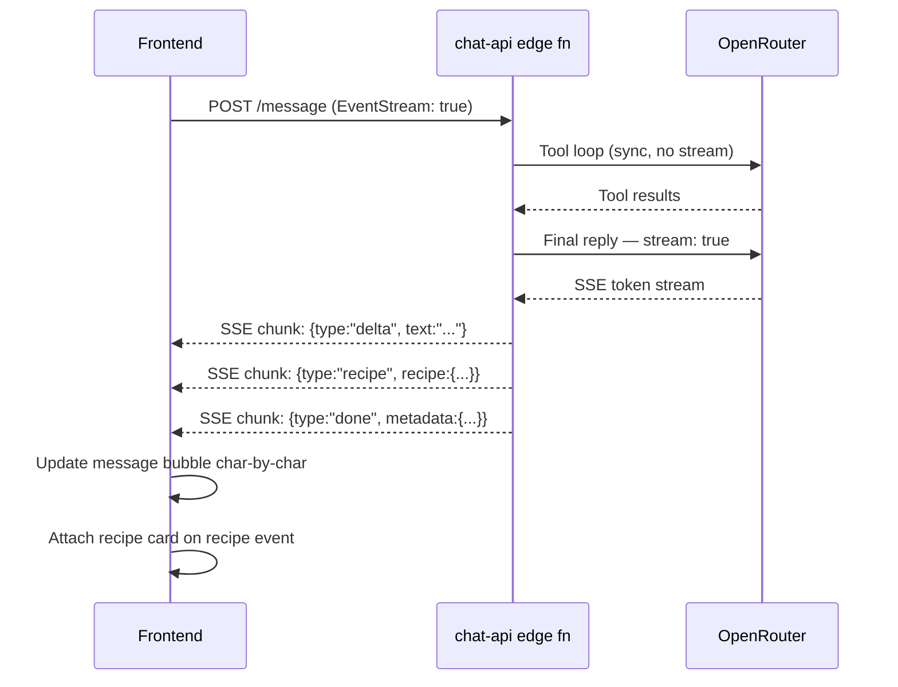

# MOP-0017: Streaming Chat Responses

| Field | Value |
|-------|-------|
| **MOP** | MOP-0017 |
| **Title** | Streaming Chat Responses |
| **Date Submitted** | 2026-09-03 |
| **Date Updated** | 2026-09-04 |
| **Date Completed** | — |
| **Submitted By** | Nick Neal |
| **Status** | verifying |

> Status vocabulary defined in [docs/prompts/MOP_STATUS_LIFECYCLE.md](../prompts/MOP_STATUS_LIFECYCLE.md).

---

## Summary

The chat agent currently processes the full tool loop and LLM generation server-side before returning a single JSON blob. The user sees a spinner for 12–48 seconds with no feedback. This MOP switches the final model text reply to SSE streaming so the user sees words within 1–2 seconds, while the tool loop (URL fetch, extraction, search) still runs synchronously before streaming begins.

**Phase 1 (shipped separately as a quick win):** Optimistic "thinking" placeholder bubble — purely frontend, no backend change. Eliminates dead silence from second zero. See commit `dc8bf5d`.

**Phases 2–4 (this MOP):** True server-sent-event streaming from the edge function → frontend SSE reader → incremental message bubble updates.

---

## Why not a queue / background job?

A job queue was considered and ruled out for the MVP streaming use case:
- **For simple chat (12s):** streaming shows text within 1–2s — far better than polling a job.
- **For recipe extraction (48s):** the tool loop (URL fetch + LLM extract) dominates. Streaming only saves the final 3–5s of text generation. The optimistic placeholder (Phase 1) has better ROI here.
- **Polling complexity:** requires a job-status table, realtime subscription, and retry logic — more code than SSE for lower perceived benefit.

A job queue remains worth revisiting if we add long-running background tasks (video batch processing, weekly meal plan generation). Captured as a `defer` trigger here.

---

## Architecture



Key design decisions:
- **Tool loop stays synchronous.** Tools must complete before the model can write its answer. No partial streaming of tool results.
- **Two modes on the same endpoint.** A request header `Accept: text/event-stream` opts into streaming. Non-streaming callers (mobile, tests) continue to receive JSON. This avoids a separate endpoint and migration.
- **Recipe card arrives as a terminal SSE event**, not embedded in the text stream. The frontend attaches it to the message when the event arrives.
- **Error mid-stream.** A `{type:"error", message:"..."}` SSE event signals the client to show an error state; the partial text is preserved.

---

## Scope Map

```
supabase/functions/_shared/openrouter-client.ts     (add streamChatWithTools)
supabase/functions/chat-api/agent-loop.ts            (add streamFinalReply mode)
supabase/functions/chat-api/index.ts                 (detect Accept: text/event-stream; write SSE encoder)
src/services/api.ts                                  (sendMessage: SSE reader branch)
src/components/chat/ChatInterface.tsx                (incremental bubble update, recipe event handler)
src/hooks/useSendMessage.ts (if exists)              (may need streaming variant)
```

Domain: `chat` per [DOMAIN_TEST_MATRIX.md](../prompts/DOMAIN_TEST_MATRIX.md).

---

## Scope of Work

### Phase 1: Optimistic placeholder bubble — **complete (2026-09-03)**

Shipped in commit `dc8bf5d` as part of the chat card fix batch. Purely frontend. Adds a "Thinking…" AI bubble immediately on send; replaced by the real response when it arrives. No backend change.

### Phase 2: OpenRouter streaming client

**Files:** `supabase/functions/_shared/openrouter-client.ts`

Add `streamChatWithTools(systemPrompt, messages, tools, onDelta)` method:
- Calls OpenRouter with `stream: true`
- Reads the SSE body with a `ReadableStream` reader
- Calls `onDelta(text: string)` for each `content` delta
- Returns the final `{content, tool_calls, finish_reason}` envelope on stream end
- Handles `[DONE]` sentinel, skips `data: [DONE]` lines

### Phase 3: Edge function SSE mode

**Files:** `supabase/functions/chat-api/agent-loop.ts`, `supabase/functions/chat-api/index.ts`

- `index.ts` detects `Accept: text/event-stream` header
- If streaming: returns a `ReadableStream` response with `Content-Type: text/event-stream`
- `agent-loop.ts` accepts an optional `onDelta` callback; when set, the final model call uses `streamChatWithTools` and forwards deltas via the callback
- `index.ts` SSE encoder writes:
  - `data: {"type":"delta","text":"..."}\n\n` — one per token batch
  - `data: {"type":"recipe","recipe":{...}}\n\n` — after tool loop, if recipe extracted
  - `data: {"type":"metadata","conversationId":"...","messageId":"..."}\n\n` — for persistence
  - `data: {"type":"done"}\n\n` — stream end
  - `data: {"type":"error","message":"..."}\n\n` — on throw
- Non-streaming path unchanged (JSON response, full backwards compat)

### Phase 4: Frontend SSE reader

**Files:** `src/services/api.ts`, `src/components/chat/ChatInterface.tsx`

- `api.ts` `sendMessage` detects streaming support (feature flag or always-on); if streaming, uses `fetch` with `Accept: text/event-stream` and returns an `AsyncIterable<SSEEvent>`
- `ChatInterface.tsx`:
  - Creates the AI message bubble immediately with empty content
  - Appends delta text as it arrives (one `setConversations` call per SSE batch, debounced to ~16ms)
  - On `recipe` event: attach recipe card to the message
  - On `done` event: mark message complete, clear placeholder
  - On `error` event: replace content with error message

### Phase 5: Tests + docs

- Unit test: `openrouter-client.test.ts` — mock SSE stream, assert `onDelta` called per chunk
- Integration smoke: local Supabase, assert streaming response header + at least 2 SSE chunks
- Update `docs/ARCHITECTURE.md` (chat pipeline section)
- Update `docs/API.md` (streaming endpoint contract)
- Update `docs/RUNBOOK.md` (streaming debug: `curl -N -H 'Accept: text/event-stream'`)

---

## Priority

| Priority | Item | Effort |
|----------|------|--------|
| P2 | Phase 2 — streaming OpenRouter client | S |
| P2 | Phase 3 — edge function SSE mode | M |
| P2 | Phase 4 — frontend SSE reader | M |
| P3 | Phase 5 — tests + docs | S |

Not P1 because Phase 1 (optimistic placeholder) already eliminates the dead-silence UX gap. Streaming is a quality improvement, not a blocker.

---

## Deferred: background job queue

If a future feature needs true background processing (batch video import, weekly plan generation, nightly re-embedding), revisit as a separate MOP. Trigger condition: any user-initiated operation that takes >60 seconds and cannot be cancelled without data loss.

---

## Verification

```yaml
verification:
  - id: streaming-client-method
    type: grep
    path: supabase/functions/_shared/openrouter-client.ts
    pattern: 'streamChatWithTools'
    expect: present

  - id: sse-content-type
    type: grep
    path: supabase/functions/chat-api/index.ts
    pattern: 'text/event-stream'
    expect: present

  - id: backwards-compat-json
    type: grep
    path: supabase/functions/chat-api/index.ts
    pattern: 'Accept.*text/event-stream'
    expect: present

  - id: frontend-sse-reader
    type: grep
    path: src/services/api.ts
    pattern: 'event-stream|getReader|SSEEvent'
    expect: present

  - id: lint-clean
    type: command
    # Pre-existing @typescript-eslint/no-explicit-any warnings are acceptable;
    # zero errors is the hard gate (lint exits 0 when errors == 0).
    run: npm run lint
    expect_exit: 0

  - id: build-clean
    type: command
    run: npm run build
    expect_exit: 0

  - id: tests-pass
    type: command
    run: npm run test:run
    expect_exit: 0

  - id: sse-headers-present
    type: grep
    path: supabase/functions/chat-api/index.ts
    pattern: 'SSE_HEADERS'
    expect: present

  - id: readable-stream-branch
    type: grep
    path: supabase/functions/chat-api/index.ts
    pattern: 'ReadableStream'
    expect: present

  - id: frontend-stream-callbacks
    type: grep
    path: src/components/chat/ChatInterface.tsx
    pattern: 'sendMessageStream'
    expect: present
```

---

## Acceptance Criteria

- [ ] All `verification` block items pass
- [ ] Non-streaming callers (mobile, existing tests) continue to receive JSON unchanged
- [ ] First text delta arrives within 2 seconds of request start (measured in Chrome DevTools)
- [ ] Recipe card still renders correctly (via the `recipe` SSE event)
- [ ] Error mid-stream shows an error state; no silent failure
- [ ] Optimistic placeholder (Phase 1) is removed once streaming begins — no double bubble
- [ ] CHANGELOG entry added

---

## Related

- **Phase 1 commit:** `dc8bf5d` (optimistic placeholder, shipped 2026-09-03)
- **MOPs:** MOP-0008 (chat agent), MOP-0016 (video intake)
- **ADRs:** none (extends existing chat architecture; streaming is a transport change, not a new capability)
- **SME:** `chat-rag-sme` for diagnosis, `cooking-bot-architect` for design review before Phase 3
